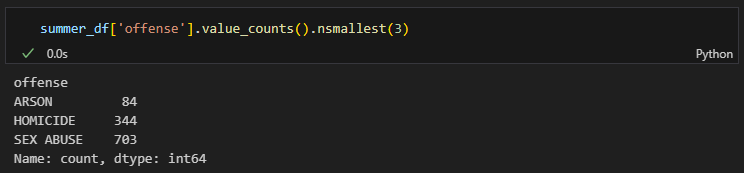
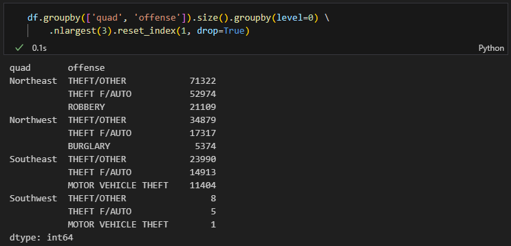
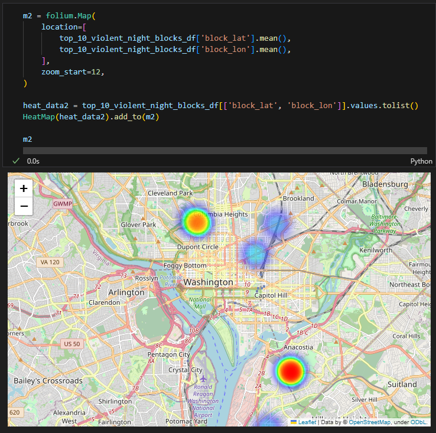

# DC-Crime-Data-Analysis

Demonstration of data preparation, exploratory data analysis, and generating insights from data using the [open-source DC crime dataset](https://www.kaggle.com/datasets/vinchinzu/dc-metro-crime-data/data) (2008-2017) from Kaggle. 

Took inspiration from Rob Mulla's EDA tutorial [here](https://www.youtube.com/watch?v=xi0vhXFPegw&t=2252s).

## Feature Analysis

A couple simple plots to visualize individual features in the dataset for analysis (univariate analysis).

**Top 5 Offenses**

**Offenses Over Time**

## Generating Insights

A few hypothetical questions that law enforcement leaders or public policy leaders might ask; using just this data,  we can provide actionable insights to help stakeholders to make informed enforcement or policy decisions.

### Seasonal Questions & Insights

For these purposes, Summer is simply defined as July, August, and September. 

**What was the top offense for summer months?**

* THEFT / OTHER

**What were the 3 least common offenses for summer months?**

* ARSON, HOMICIDE, and SEX ABUSE

**What was the top offense for each hour of the day for summer?**

* THEFT/OTHER or THEFT/AUTO for all hours except 0200 (2am) which was ROBBERY

### City Quadrant Questions & Insights

**What were the top 3 offenses for each quadrant?**

* Northeast 
    * THEFT/OTHER           71322
    * THEFT F/AUTO           52974
    * ROBBERY                21109
* Northwest  
    * THEFT/OTHER            34879
    * THEFT F/AUTO           17317
    * BURGLARY                5374
* Southeast  
    * THEFT/OTHER            23990
    * THEFT F/AUTO           14913
    * MOTOR VEHICLE THEFT    11404
* Southwest  
    * THEFT/OTHER                8
    * THEFT F/AUTO               5
    * MOTOR VEHICLE THEFT        1

**What was the most violent quandrant based on number of reported offenses?**

* Northeast

### Location-Based Analysis Questions & Insights

**What were the top five blocks for auto theft for each quadrant, visualized (as a heatmap)?**

[Table]

[Heatmap]

**What were the top 10 blocks with the most reported violent crimes that occurred during the night (2200-0400, 10pm-4am)? Where were they?**

[Table]

[Heatmap]
